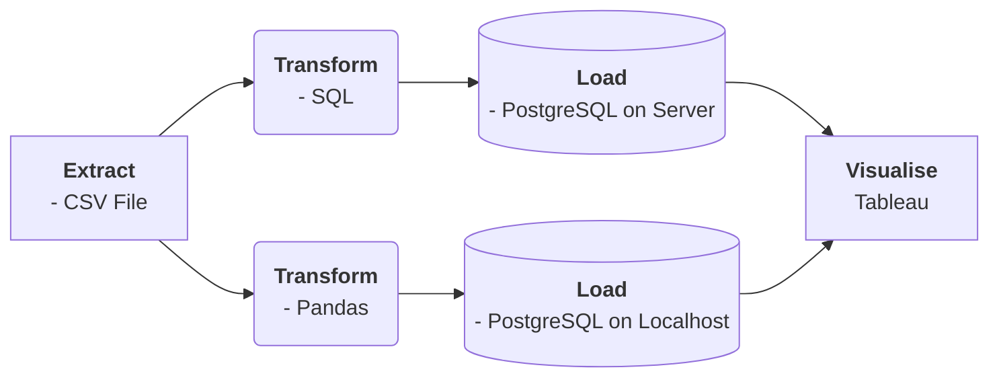
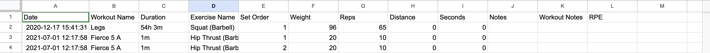
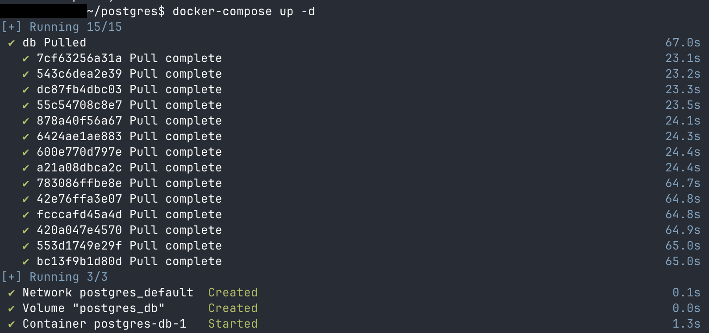
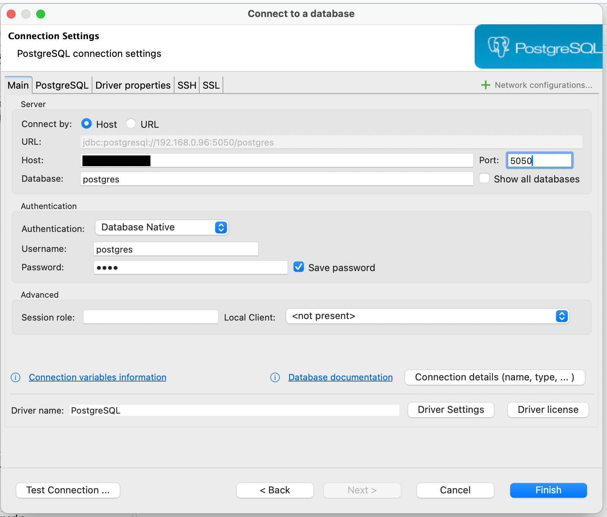
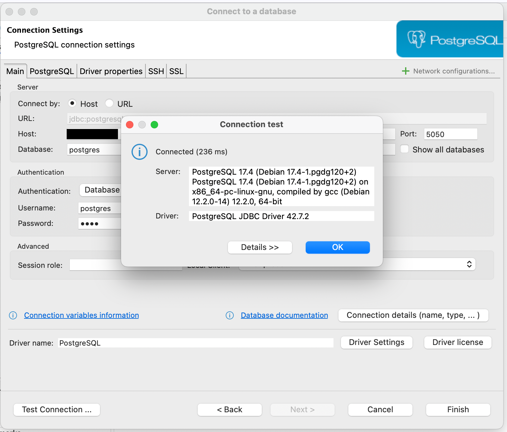
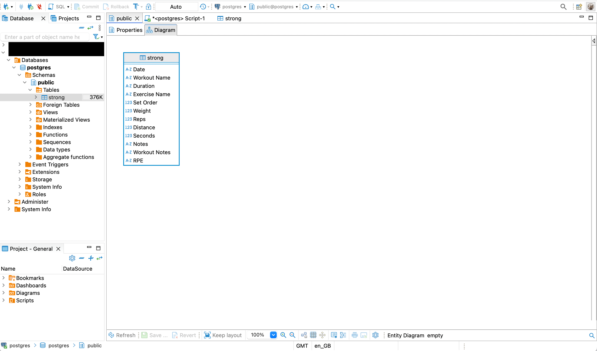
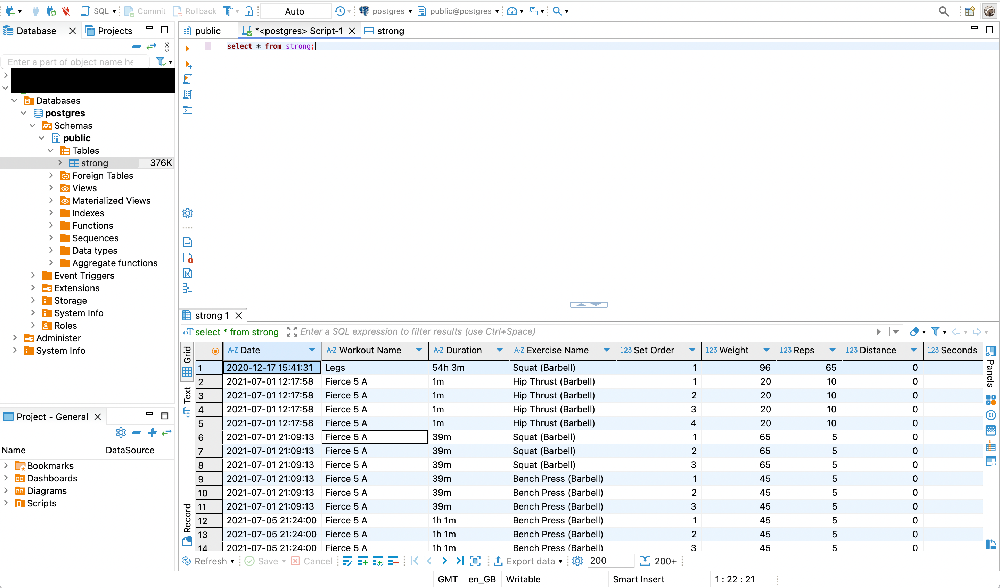

# Introduction

In this project my aim is to create an ETL pieline for my weightlifting data from an app. 

The data is downloaded from the app in a CSV format, I have tried two ways of transforming the data, using SQL and Pandas. 

Post transformation, the data is loaded onto either a localhost database or a databse hosted on a local server.

Finally, the data will be visualised using Tabluea, with the aim of identifying lifts where I'm not progressing.



## Index
- [Get Started](#the-data)
- [SQL](#sql)
- [Pandas](#pandas)
- [The Database](#the-data)
- [Tabluea](#the-data)

## Run

You will need: python3, dbeaver/other platform that you can access a databse with, postgres db

Clone repo

optional(recommended)
set up virtual environment

install requirements

Set up your environment variables - for your db

run.py


## The Data
The data was downloaded from the app in the CVS format, it is also included in the repo in /data.



From first glance, you can see that the data is in one large table. There are many blank columns that will need to be removed, I will also need to look at the data closer to find any issues that are not so obvious at first glance.


DELETE IMG7 - RECREATE THE NORMALISATION DIAGRAM

Created with [quickdatabasediagrams.com](https://app.quickdatabasediagrams.com/#/)


## SQL

This projected was started as soon as we had finished learning basic SQL. Using SQL I methodically went through the data and performed the following quality check queries and adjustments:
- Check rows
- Check columns
- Check for nulls 
- Drop unwanted columns
- Add a primary key
- Adjust column names  

Write what I found during the checks...
Duration was text during asc/desc
that there were sets with 0 reps in asc/desc
There were columns with missing data that i removed
There was no primary key
changed names so that there were nocapitals and spaces

The data was not normalised - but this will be difficult to do in sql and I did not know how to

The adjustments and checks cound be found in /SQL

Data manually loaded into the DBeaver before the transforamtion with SQL 


## Pandas

Once I learned Pandas I revisited this project, also with the aim of writing simple functions and to practise writing some tests
This is not perfect - I will need to practise tests and writing more functions 

Pandas made it easier to normalise data 
See below how the normalisation tables:


Data was read using pandas, then transformed
Same changes as I did with SQL apart from the adition of normalisation
Unofrtunately was not able to load data into the database using the code. Have trouble shooted but I think there could be an error with the databse configuration - but not too sure yet.
I have tried:
Pinging into the container at the correct port
have checked the details of my env file 
have disconnected from my DBeaver and tried uploading
loading data using sqlalchemy 
loading using psgcop2
was able to access and edit in dbeaver but jsut not able to with code
checked firewall 

Have not tried creating a new virtual env
looked at configure file in docker


Instead loaded the data onto a localhost. 
Please let me know if you see the issue.


## The Database
I have a local server, it is a cheap Lenovo mini PC bought from Ebay for about £50. It has the  Ubuntu server distro installed. 
I will be setting up a PostgreSQL database onto it.

I created a directory in my server. 
Using github SSH I pulled the attached docker-compose.yml file onto my local server.
I changed the password and database username, as well as the port number (as I have other programs installed). 
The first port number is the port that will need to be used to connect to your server. 

Following the adjustments in the file I entered the following command in the terminal: 

```terminal
docker-compose up -d 
```



This runs the container and installs the database!

### Install Confirmation

To confirm that the database has been set up, I opened DBeaver on my main computer. 

I connected to the database as per the following image:




Test the connection and finally confirm! 

Now I can upload data into the database!





## Tabluea
Data was visualised using Tableau: 

Link to a platuea I have ID'd

