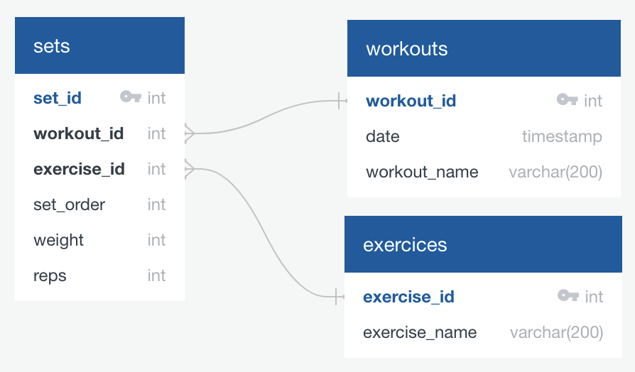

# Introduction

In this project my aim is to create an ETL pieline for my weightlifting data from an app. 

The data is downloaded from the app in a CSV format, I have tried two ways of transforming the data, using SQL and Pandas. 

Post transformation, the data is loaded onto either a localhost database or a databse hosted on a local server.

Finally, the data will be visualised using Tabluea, with the aim of identifying lifts where I'm not progressing.


## Index
- [Clone and Run](#clone-and-run)
- [The Database](#the-database)
- [SQL](#sql)
- [Pandas](#pandas)
- [Tabluea](#tabluea)

## Clone and Run

To run the code you will need python3 (3.12 is the version I used), DBeaver (or another SQL IDE), PostgreSQL.


Clone the repository in the folder of your choice:
```git
git clone
```


Optional but recommended is to set up a virtual python environment:
(This is the instruction for Mac OSX, windows will be different)
```terminal
python3 -m venv .venv 
source .venv/bin/activate
```


Install the python3 packages:
```terminal
pip install -r requirements.txt
```


Create a .env file in the root directory and set up your database variables:
```env
DB_HOST= enter_host
DB_NAME= enter_db_name
DB_USER= enter_username
DB_PASSWORD= enter_password
DB_PORT= enter_port
```


Run the code:
```terminal
python3 source/run.py
```

## The Database
I have a local server, it is a cheap Lenovo mini PC bought from Ebay for about £50. It has the Ubuntu server distro installed. 

I will be setting up a PostgreSQL database onto it.

I created a directory in my server. 
Using github SSH I pulled the docker-compose.yml file onto my local server, the docker file can be found in the /docker directory.
I changed the password and database username, as well as the port number (as I have other programs installed). 
The first port number is the port that will need to be used to connect to your server. 

Following the adjustments in the file I entered the following command in the terminal: 

```terminal
docker-compose up -d 
```


This runs the container and installs the database!

### Install Confirmation

To confirm that the database has been set up, I opened DBeaver on my main computer. 

I connected to the database as per the following image:


Test the connection and finally confirm! 

Now I can upload data into the database!


## The Data
The data was downloaded from the app in the CVS format, it is also included in the repo in /data.


From first glance, you can see that the data is in one large table. There are many blank columns that will need to be removed, I will also need to look at the data closer to find any issues that are not so obvious at first glance.


## SQL

Data was manually loaded into DBeaver before the transforamtion with SQL 

This projected was started as soon as we had finished learning basic SQL. Using SQL, I methodically went through the data and performed the following quality check queries and adjustments:
- Counted rows
- Counted columns
- Checked for nulls
- Sorted each column by asc and desc

When I rder by ascending, I found out that the duration column was in text and that there were sets of exercises recorded with 0 reps. 
I decided to drop the duration column as I had also in many cases forgotten to end the workout so there were many entries with incorrect duration, but its also a metric that I' not interested in. 
I would skip exercises by entering 0 reps, this was to ensure that my workout templates would not be changed by the app. So I will be removing these rows.

I made the following changes:
- Dropped unwanted columns
- Added a primary key
- Adjusted column names
- Removed rows with 0 reps

I would have liked to normalise the data at this point, however this will be difficult in SQL, I will be doing this with Pandas.

The adjustments and checks can be found in the /sql folder.

## Pandas

Once I learned Pandas I revisited the transformation, also with the aim of practising python and test writing.
This is not perfect - and I will be aiming to start my next projects with a test driven development approach.

I made all the adjustments in SQL, with the addition of data noramlisation - which was much easier in python, please see the normalisation tables below:



Created with [quickdatabasediagrams.com](https://app.quickdatabasediagrams.com/#/)

Unofrtunately, I was not able to load the transformed data into the databse on my server. I have instead loaded it onto a databse on my laptop.
I have tried the following:
- Pinging into the container at the correct port
- Triple checkeded the details of my env file 
- Disconnected from DBeaver and tried uploading
- Loading data using sqlalchemy
- Loading using psycopg2
- Checked firewall 

There are a few options that I have not tried yet:
- Creating a new virtual env
- Looked at the postgreSQL config files

Please let me know if you see what the issue could be from the code.

With Pandas I was also able to ensure that loading would only be performed for new rows, this is to make the loading more efficient. So I can keep downloading new CSV files and uploading them onto my database - and only the rows with new ID numbers will be loaded!

## Tabluea

The data was manually exported from the databse, then uploaded into Tableau and visualised.

[Basic Visualisation](https://public.tableau.com/app/profile/sayed.sais/viz/Book1_17451892279930/Dashboard1?publish=yes)

This is a basic visualisation for one of the lifts, as you can see on 21 and 29 Mar2025 I had the same number of total reps and weight. That meansa that I need to target that exercise for a deload - which I did not do as I did not have this visual aid.

